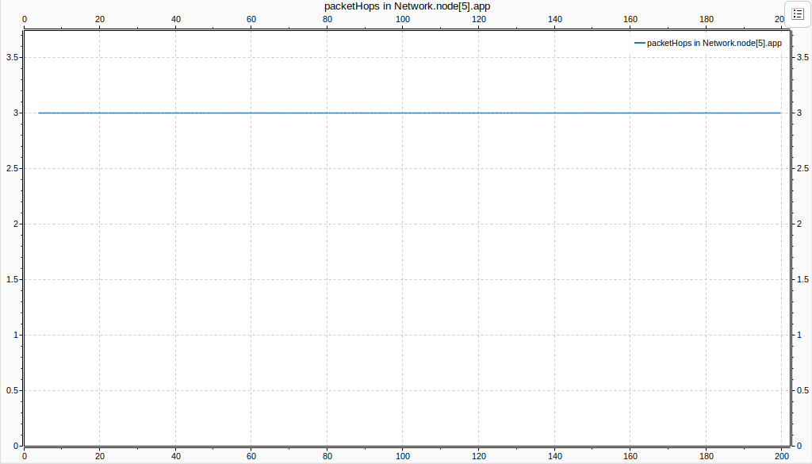

## Indice

* [Introducción](#introducción)

* [Experimentos y preguntas](#experimentos-y-preguntas)

    * [Análisis con algoritmo inicial](#análisis-con-algoritmo-inicial)
    
    * [Análisis con mejora en el algoritmo](#análisis-con-mejora-en-el-algoritmo)

* [Punto estrella](#punto-estrella)

## Introducción

En este trabajo se utilizó una red en forma de anillo, en el que cada nodo está conectado a otros dos nodos.

Internamente, cada nodo tiene dos capas de enlace (una con cada vecino), una capa de red (net) y una capa de aplicación (app). En nuestro algoritmo, se reciben paquetes y se verifica su destino. Si el nodo que estamos "analizando" es el destino, se envía el paquete a la capa de aplicación; de lo contrario, se sigue enviando el paquete hasta que llegue a su destino.

## Experimentos y preguntas

### Análisis con algoritmo inicial

 Con el primer algoritmo los paquetes se envían al vecino ubicado a la derecha del nodo. Los paquetes se envían en dirección de las agujas del reloj. En esta implmentación, no se elige la ruta más "óptima" para enviar un paquete, se envían los paquetes sin un análisis o reconocimiento de las distancias entre todos los enrutadores que forman parte de nuestra red.

### Caso 1:

*node[0]* y *node[2]* transmiten datos a *node[5]*.

#### Tamaño de los buffers

Se puede observar una recarga en buffer del *node[0]*. Esto se produce ya que el *node[0]* se carga no solo con los paquetes que el mismo genera, si no que también con los que vienen desde *node[2]*.

#### Delay de los paquetes

Se ve que la sobrecarga en el buffer del *node[0]* hace que los paquetes tarden cada vez más en llegar a destino.

#### Cantidad de saltos de los paquetes

Se puede ver en este gráfico que va de 3 a 5 constantemente, esto es porque los paquetes que se envian desde el *node[2]* hacen 5 saltos hasta llegar a *node[5]*, pero los del *node[0]* sólo 3. Esto nos indica que este algoritmo de enrutamiento no es óptimo ya que si observamos la topología de la red podemos darnos cuenta que se puede enviar un paquete desde *node[2]* a *node[5]* en solo 3 saltos.

### Caso 2: 

Los nodos (0,1,2,3,4,6,7) generan tráfico hacia el *node[5]* con packetByteSize e interArrivalTime idénticos entre todos los nodos.

#### Tamaño de los buffers

Se puede ver en este caso que al estar todos los nodos generando paquetes y al mismo tiempo recibiendo los de los nodos a su izquierda, que sus buffers comienzan a llenarse debido a la gran cantidad de paquetes que deben de manejar. La única excepción es el *node[4]*, ya que nunca llega a recibir paquetes de otro nodo y solo debe manejar los propios. 

#### Delay de los paquetes

Se puede observar tambien que la congestión en la red provoca un aumento en el retardo de la llegada de paquetes. Se ve tambien que hay veces que tarda 0, esto se debe a que el nodo 5 se envía paquetes a si mismo. 

#### Cantidad de saltos de los paquetes

## Análisis con mejora en el algoritmo

Para un mejor análisis, implementamos el algoritmo de enrutamiento de Vector de Distancia, el cual es un método  utilizado para determinar las rutas óptimas en una red.

La explicación breve de nuestra implementación es la siguiente:

Cada nodo en la red mantiene una tabla de enrutamiento. Esta tabla contiene la distancia (número de saltos) a cada nodo en la red y la dirección (nodo vecino) a través del cual se debe enviar el paquete para alcanzar ese destino.
Inicialmente, cada nodo solo conoce la distancia a sí mismo (0 saltos). Las distancias a todos los demás nodos se conocen a medida que llegan sus tablas.
Periódicamente, cada nodo envía su tabla de enrutamiento a sus vecinos inmediatos.
Al recibir una tabla de enrutamiento de un vecino, un nodo actualiza su propia tabla de enrutamiento comparando las rutas conocidas con las nuevas rutas informadas por el vecino. Si una nueva ruta a un destino a través de un vecino es más corta que la ruta conocida anteriormente, el nodo actualiza su tabla de enrutamiento para reflejar esta nueva ruta más corta.

### Caso 1

#### Tamaño de los buffers

El *node[0]* y el *node[2]* tienen distintos caminos óptimos hacia el *node[5]*. Por lo tanto no  habrá ningún camino en común entre los paquetes generados por Nodo 0 y Nodo 2. Por lo tanto el máximo tamaño de buffer alcanzado por el algoritmo mejorado es mucho menor al tamaño de buffer alcanzado por el algoritmo inicial.

#### Delay de los paquetes

La demora máxima en el algoritmo mejorado es menor que en el algoritmo inicial. Esto se debe, principalmente, a que en el algoritmo inicial no se selecciona la ruta óptima para enviar paquetes desde el *node[2]* al *node[5]*. Además, en un tramo de la ruta, se envían paquetes tanto desde el *node[0]* como desde el *node[2]*, lo cual genera un mayor retraso debido a que hay más paquetes de los que esos enlaces pueden manejar.

#### Saltos de los paquetes

Con nuestra mejora de algoritmo, los paquetes enviados desde el *node[0]* como desde el *node[2]* "tardan" 3 saltos en llegar hacia el *node[5]* gracias a la elección de ruta óptima. Esto no sucede con el algoritmo inicial, por lo que podemos observar picos en el gráficos. 
 

### Caso 2 

#### Tamaño de los buffers

Al comparar los tamaños de buffer podemos notar que ,tanto en el caso de estudio 2 con el algoritmo inicial y el caso de estudio 2 con el algoritmo mejorado, los buffers se llenan debido a la sobrecarga de la red. En el algoritmo mejorado, este proceso ocurre más lentamente. En ambos casos la red se satura, entonces ocurre la acumulación de paquetes en los buffers.

#### Delay de los paquetes

Gracias al algoritmo mejorado, hay más valores cercanos a los mejores casos ya que  más nodos cercanos al destino utilizan la ruta óptima.

#### Saltos de los paquetes

Como el 5 es el único receptor,desde cada *node[i], i=0,1,2,3,4,6,7* se  analiza cada uno de los posbiles casos respecto a los saltos de los paquetes y se elige el más óptimo. El peor caso dentro de los mas óptimos sería que un paquete "tarde" 4 saltos. 

## Punto estrella

A continuación se presentan las métricas para cada caso en el punto estrella, en el cual la red tiene la siguiente topología: 

### Tamaño del buffer caso 1

En esta red cada nodo tiene 4 interfaces, pero no todas ellas están conectadas. En el caso de los nodos generadores, la interfaz 0 no está conectada, lo cual produce que los paquetes no tengan por donde salir y son descartados.

### Tamaño del buffer caso 1 implementado

Una vez implementado el algoritmo de enrutamiento, los enrutadores eligen el camino más óptimo al destino. En este caso los paquetes que salen del nodo 2 y 5 se conectan a la red sólo a través del nodo 1, lo que hace que se de una sobrecarga en este nodo.

### Otras métricas del caso 1

### Métricas caso 2

#### Tamaño de los buffer

#### Delay

#### Hops

### Métricas caso 2 implementado

#### Tamaño de los buffer

#### Delay

#### Hops

Autores: Gastón Prato, Mauricio J. LLugdar, Santino Quevedo.
